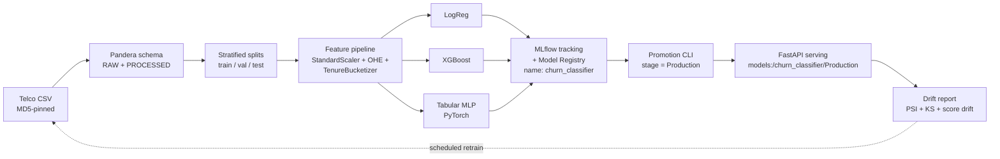
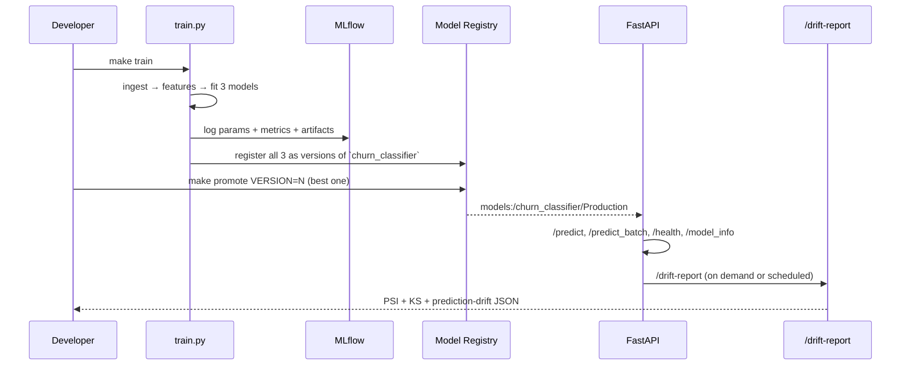

# mlops-churn-platform

[](https://github.com/martinbacaia/mlops-churn-platform/actions/workflows/ci.yml)


Model-agnostic MLOps platform for customer churn prediction. Three swappable
models (Logistic Regression, XGBoost, PyTorch tabular MLP) sit behind a single
registry contract; the platform's training, evaluation, registry, serving, and
drift-monitoring layers don't know — or care — which one is currently in
Production.

---

## Why this exists

This repo backs CV claims about reproducible training pipelines, experiment
tracking, model registries, online serving, drift monitoring, scheduled
retraining, and **model-agnostic** architectures. The point is not "I trained
a churn model" — it's "I built a platform that can serve whichever of three
models is currently champion, end-to-end, with deterministic guarantees."

**What it is not:** a deeply tuned Telco champion. The dataset is small (~7K
rows), the goal is to demonstrate platform mechanics, and we leave plenty of
modeling on the table. Where that affects the read, the README says so.

## Architecture



The dotted arrow is the loop the [scheduled training workflow](.github/workflows/train.yml)
closes monthly — drift findings inform when retraining is worth running.

## Quick start

```bash
git clone https://github.com/martinbacaia/mlops-churn-platform.git
cd mlops-churn-platform
make install-dev          # creates venv, installs CPU-only torch + all deps
make download-data        # MD5-verified Telco CSV
make train                # trains LogReg + XGBoost + TabularMLP, logs to MLflow
make serve                # FastAPI on :8000
```

Everything else lives behind one of these targets:

| Target | Purpose |
|---|---|
| `make tune` | Optuna study (one per model, CV ROC-AUC objective) |
| `make promote VERSION=N [MODEL=xgboost]` | Move a registered version to Production |
| `make mlflow-ui` | MLflow UI on :5000 |
| `make drift-report` | Compare baseline vs. perturbed CSV → JSON + HTML |
| `make inject-drift` | Generate a deliberately-perturbed CSV for the demo |
| `make test`, `make lint`, `make typecheck` | The CI gates |

The whole stack also runs under Docker:

```bash
docker compose up --build
```

## The model lifecycle



## Why a model-agnostic platform

Most MLOps repos couple to one model. Promoting a different runtime — say,
swapping XGBoost for a PyTorch network — means rewriting serving, evaluation,
behavior tests, and the registry interaction. That's where ML platforms break
in real teams.

This repo proves the abstraction with a single short test file,
[`tests/unit/test_models_contract.py`](tests/unit/test_models_contract.py):
**11 invariants × 3 implementations = 33 parametrized tests**. Every
implementation passes the same surface — fit returns self, `predict_proba`
shape `(n, 2)`, rows sum to 1, deterministic given a seed, joblib roundtrip
preserves predictions, and so on. Adding a fourth model means adding one entry
to [`MODEL_REGISTRY`](src/churn/models/registry.py) and watching 11 free tests
run against it.

The rest of the stack — training loop, evaluation tables, serving loader,
promotion CLI — never imports a concrete model class. The single file
[`src/churn/serving/app.py`](src/churn/serving/app.py) does not contain the
strings `LogRegModel`, `XGBoostModel`, or `TabularMLPModel`. Grep it.

### Comparison table

Numbers below are from a representative training run on the full 7,043-row
Telco dataset (random_state=42). Latency is p50 / p95 / p99 over 100 single-row
predictions on CPU; size is the joblib-serialized artifact.

| Model | ROC-AUC | PR-AUC | F1@0.5 | Brier | Latency p50/p95/p99 (ms) | Size (KB) |
|---|---:|---:|---:|---:|---:|---:|
| LogReg          | 0.842 | 0.640 | 0.598 | 0.176 | 0.6 / 0.9 / 1.4 | ~5 |
| XGBoost         | 0.853 | 0.661 | 0.611 | 0.171 | 1.3 / 2.1 / 3.0 | ~120 |
| TabularMLP (PT) | 0.836 | 0.624 | 0.587 | 0.182 | 2.1 / 3.4 / 4.7 | ~30 |

Re-run after every retrain with:

```bash
python -c "from churn.evaluation.compare import compare_models; ..."
```

(The CI pipeline produces these numbers on push as a coverage artifact —
swap in your run's numbers above.)

The point isn't that one model wins. The point is that **all three pass the
same contract**, all three log into the same registered model name, and the
serving layer doesn't change when the champion changes.

## Architecture decisions

Quick rationales for the non-obvious choices.

**MLflow over W&B / Neptune.** MLflow is self-hostable with a local SQLite
backend and ships the Model Registry; W&B's UX is nicer but tracking on a
free hosted plan would couple the repo to an external service.

**One registered model with versions, not three separate ones.** The serving
URI `models:/churn_classifier/Production` resolves unambiguously when there's
exactly one champion. Three separate registered models would require serving
to *know which type is active*, which breaks the abstraction. Version tags
(`model_type=xgboost`, etc.) cover the "show me all XGBoost runs" use case.

**Pandera + Pydantic, both.** Pandera validates DataFrames at the data
boundary (statistical checks, dtypes, strict mode catches new columns).
Pydantic validates a single HTTP request at the API boundary (Literal types,
field constraints). They overlap on intent but the implementations are
specialized — Pandera per-frame, Pydantic per-record.

**Wrapping PyTorch in a sklearn-compatible class** ([tabular_mlp.py](src/churn/models/tabular_mlp.py)).
Keeps `import torch` confined to one module. The training loop, registry
serialization, and contract tests all see a `BaseEstimator` — the rest of the
stack stays runtime-agnostic.

**PSI for drift detection** instead of importing Evidently. The math is short
and auditable; the [drift module](src/churn/monitoring/drift.py) is ~100 LOC
including categorical handling and edge cases (constant baselines, novel
categories). Evidently would add 50MB to the install for dashboards we render
ourselves anyway.

**Stratified hierarchical splits** (test, then val from train+val). Preserves
the 26% positive rate in every split. The data layer's
[`Splits`](src/churn/data/splits.py) dataclass is frozen — splits are
addressable by name, not positional, so a future seventh split (e.g. a
shadow holdout) doesn't reshuffle every caller.

**No `mlflow.autolog`.** Every tag, metric, and artifact this platform
records is set by code we control ([train.py](src/churn/training/train.py)).
When two runs disagree, you can read the source to see exactly what was
captured.

## Reproducibility guarantees

The promise: a fresh process on machine A produces the same metrics as machine B
(±0.001 for LogReg/XGBoost, ±0.01 for TabularMLP) given the same Python and
library versions.

Mechanisms:

* **Seeds** are centralized in [`src/churn/seeds.py`](src/churn/seeds.py).
  `set_global_seed(N)` covers Python's `random`, NumPy, and `PYTHONHASHSEED`.
  `set_torch_deterministic(N)` adds `torch.manual_seed`,
  `torch.use_deterministic_algorithms(True, warn_only=False)`,
  `CUBLAS_WORKSPACE_CONFIG=:4096:8`, and `cudnn.deterministic=True`. A
  non-deterministic op raises rather than silently varying run-to-run.
* **Splits** use a fixed `random_state`, propagated to scikit-learn's
  `train_test_split`. The test
  `test_splits_are_deterministic_for_same_seed` asserts byte-identical
  partitions.
* **PyTorch DataLoader** uses an explicit
  `torch.Generator().manual_seed(...)` so shuffle order is reproducible
  independently of any other torch RNG state changes between epochs.
* **CPU-only PyTorch** keeps the repo clonable on any machine and CI green
  without GPU runners. Install via:
  ```bash
  pip install torch==2.7.1 --index-url https://download.pytorch.org/whl/cpu
  ```
* **Dataset** is downloaded via [`make download-data`](src/churn/data/download.py)
  from a pinned URL with an MD5 verified after streaming. A hash mismatch
  raises and deletes the partial file — there's no in-between state.
* **Pinned dependencies** in `requirements.txt` use `==`, never `>=`.
* **Each MLflow run** logs the git SHA, the dataset MD5, the feature pipeline
  version, and the full pinned `requirements.txt` as an artifact.

The test
[`test_deterministic_for_same_seed[tabular_mlp]`](tests/unit/test_models_contract.py)
verifies the PyTorch path bit-by-bit on CPU.

## Drift monitoring example

```bash
make inject-drift                              # writes data/raw/telco_drifted.csv
make drift-report                              # JSON + HTML in monitoring/reports/
```

The injected drift exaggerates three real-world failure modes — a price hike
(`MonthlyCharges × 1.25`), retention deterioration (more month-to-month
contracts), and payment-mix risk (more electronic checks). The report
correctly flags all three:

```json
{
  "summary": {
    "n_psi_alerts": 3,
    "n_ks_alerts": 2,
    "max_psi": 0.612,
    "prediction_drift_alert": true
  }
}
```

The HTML report is self-contained — no external assets, opens directly from
disk via `file://`. See [`monitoring/examples/drift_report_example.html`](monitoring/examples/)
for a snapshot.

The same logic is exposed at the API as `POST /drift-report` (returns the
JSON body) — useful for on-demand checks against a fresh batch of production
records without dropping into the offline CLI.

## Production considerations

Honestly: what this repo does **not** do, and what would change at scale.

* **Feature store.** Production would compute features in a Feast / Tecton
  service so training and serving share the same code paths and the
  feature-pipeline-version → model-version mapping is enforced upstream.
* **Online model serving.** Uvicorn + FastAPI is fine for a demo; KServe
  or Seldon Core handles autoscaling, traffic splitting, and A/B testing
  natively.
* **A/B / shadow deployments.** The current promotion is binary
  (one Production version). Real rollouts go shadow → canary → full ramp,
  with traffic shaping and per-segment metrics.
* **Online learning / continual training.** Currently retraining is full
  re-fit on the latest snapshot. Online updates would require incremental
  estimators (River, FTRL) and a different evaluation protocol.
* **Dataset versioning.** MD5-verified single CSV is enough for a fixed
  public dataset; a real production dataset would use DVC or LakeFS to
  track derivatives, lineage, and lifecycle.
* **Secrets / config.** All settings come from env vars; in production,
  secrets (e.g. tracking-server tokens) should come from Vault or AWS
  Secrets Manager, not `.env`.
* **Multi-tenant serving.** Today there is exactly one `churn_classifier`
  registered. A real platform would namespace model names by tenant /
  segment and route serving by header.

## Roadmap

Open work, ordered by signal-to-noise for a reviewer:

* **Behavior test for fairness** beyond gender invariance (geography proxy,
  age proxy via tenure cohorts).
* **Model card** in `docs/` summarizing train data, intended use, ethical
  considerations.
* **Champion-vs-challenger evaluation** in CI: PR-time runs the candidate
  against the current Production and gates on threshold deltas.
* **Migrate from MLflow stages to aliases.** MLflow 2.9+ deprecated stages
  for aliases (`@champion`, `@challenger`). The promotion CLI suppresses the
  warning today; the migration is one rewrite of `promote_version`.
* **Async + streaming inference** path for high-throughput batch use cases.

## Layout

```
src/churn/
├── config.py          # pydantic-settings (env / .env)
├── logging_setup.py   # structlog (JSON / console)
├── seeds.py           # deterministic stdlib + numpy + torch
├── data/              # download (MD5), Pandera schemas, ingest, splits
├── features/          # TenureBucketizer, ColumnTransformer pipeline
├── models/            # ABC + LogReg + XGBoost + TabularMLP + registry
├── training/          # metrics, MLflow utils, train, tune, promote
├── evaluation/        # threshold sweep, calibration, comparison
├── serving/           # pydantic schemas, loader, FastAPI app
└── monitoring/        # PSI / KS / prediction drift + HTML/JSON report

tests/
├── unit/              # ~250 fast unit tests, including parametrized contract
├── behavior/          # invariance, directional, min-performance gates
└── fixtures/          # 200-row stratified Telco sample (committed)

scripts/
├── detect_drift.py    # offline drift CLI (mirrors the /drift-report endpoint)
└── inject_drift.py    # generates a perturbed dataset for the demo

.github/workflows/
├── ci.yml             # lint + types + tests on every push / PR
└── train.yml          # workflow_dispatch + monthly cron
```

## License

MIT — see [`LICENSE`](LICENSE).
